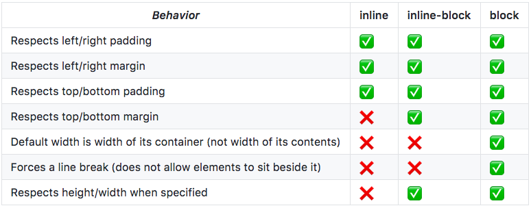
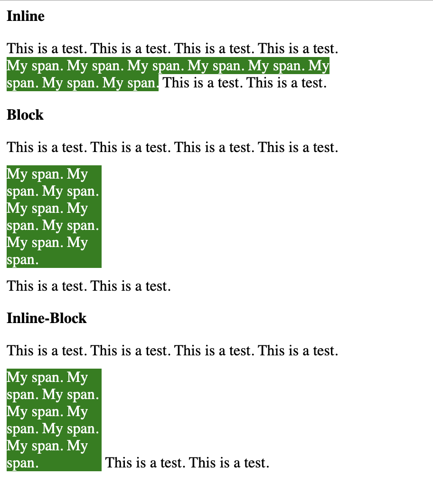

The CSS display property controls how an element is rendered on the screen. Three commonly used display types are: inline, block, and inline-block. I've used these three display types multiple times, but I've never really taken the time to fully understand how they work and their differences in behavior. With today's blog post, I just wanted to briefly highlight the key differences in these display types, with an example at the bottom. If you're like me and you're ignorant about basic CSS concepts, then hopefully this blog post will help clear up any confusion you may have.

## Inline

Inline elements will render at a size that is just big enough to hold its own content. They are capable of rendering adjacent to other inline elements or text, and can break among multiple lines. Since they render very much like text, you typically use this display type for typographical purposes. Examples of elements that display inline by default would be *span*, *a*, *img*, or *strong* elements.

Inline elements cannot have a width or a height set. Also, vertical margin will not be respected. Vertical padding will be respected,  however it will not push away the content that is rendered above and below the inline element. Typically the best way to add space above and below an inline element is to use the `line-height` CSS property.

## Block

Block elements by default will fill the entire width of its parent container. They also render with a line break before and after the element, so other elements cannot be rendered adjacent to block elements (unless the block element is floated). Examples of elements that display as block-level elements by default would be *div*, *p*, or *form* elements.

Unlike inline elements, block elements can have a width and height set. Vertical margin and padding will also be respected.

## Inline-Block

As you may have guessed, inline-block elements have characteristics of both inline and block elements. Similar to inline elements, inline-block elements can render adjacent to other inline elements or text. However, they cannot break among multiple lines. Examples of elements that display as inline-block elements by default would be `button`, `input`, or `select` elements.

Inline-Block elements respect width and height, as well as vertical margin and padding.

## Comparison Table

I saw [this GitHub gist](https://gist.github.com/Asheq/1ef5ec77b8e89c2c9da89d2b7a1cf8cb) online and found the comparison table really helpful for understanding the differences between these display types.

Here's the table:



If you like the table, then you should follow the link and star his GitHub gist.

## Example

Finally, I created a quick example to illustrate the differences between these display types. You can view the example on Codepen [here](https://codepen.io/sparsons111/pen/dyydQZR). 

Given the following HTML:

```html
<div class="wrapper">
  <strong>Inline</strong>
  <p>
    This is a test. This is a test. This is a test. This is a test. <span class="my-span inline-element">My span. My span. My span. My span. My span. My span. My span. My span.</span> This is a test. This is a test.
  </p>
  
  <strong>Block</strong>
  <p>
    This is a test. This is a test. This is a test. This is a test. <span class="my-span block-element">My span. My span. My span. My span. My span. My span. My span. My span.</span> This is a test. This is a test.
  </p>

  <strong>Inline-Block</strong>
  <p>
    This is a test. This is a test. This is a test. This is a test. <span class="my-span inline-block-element">My span. My span. My span. My span. My span. My span. My span. My span.</span> This is a test. This is a test.
  </p>
</div>
```

And the following CSS:

```css
.wrapper {
  width: 350px;
}

.my-span {
  background: green;
  color: white;
  width: 100px;
  margin: 10px 0;
}

.block-element { display: block; }
.inline-element { display: inline; }
.inline-block-element { display: inline-block; }
```

This will produce the following results:



<br />

A couple observations about the result worth mentioning:

1. Did you notice that vertical margin was only applied to the block and inline-block spans? 
2. Did you notice that the inline span breaks among multiple lines, and that the width was not respected?
3. Did you notice that the inline-block span is rendering adjacent to some of the text in the paragraph?
